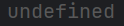
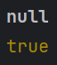
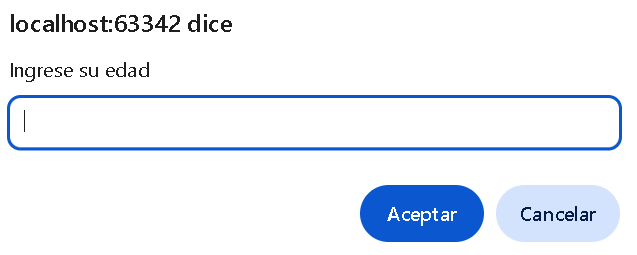
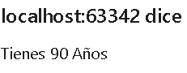
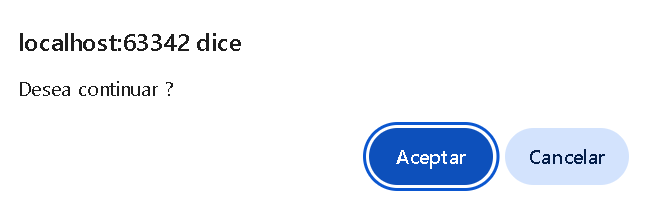
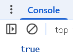
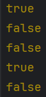

# Taller Práctico: Introducción a JavaScript

Este taller te permitirá reforzar los conceptos vistos sobre JavaScript. Completa cada sección siguiendo las consignas, escribiendo y ejecutando código en el navegador (usando la consola) o en un archivo .html vinculado con .js.
## Parte 1: Explorando JavaScript

#### 1.1 Explica con tus palabras qué es JavaScript y en qué se diferencia de HTML y CSS.
R/ javascript es un lenguaje de programación el cual se encarga de darle interabilidad y dinamismo a nuestra estrctura web desarrollada ya con html y estilizada con css

#### 1.2 Enumera al menos tres características principales de JavaScript.
- simplicidad y facilidad de aprendizaje
- Ejecución asincrónica y no bloqueante
- versatilidad y flexibilidad 

#### 1.3 ¿Qué significa que JavaScript sea un lenguaje "interpretado" y "basado en eventos"?

## Parte 2: Variables y Tipos de Datos

2.1 Declara una variable nombre y asígnale tu nombre. Luego, muestra un saludo en la consola que diga "Hola, [nombre]".

```js
    let nombre = "Santiago"
    console.log("Hola", nombre)
```

2.2 Crea tres variables: una con un número entero, otra con un número decimal y otra con una cadena de texto. Muestra cada una en la consola usando console.log().
```js
    let numENT = 5
    let NumFLOT = 6.8
    let text= "TEXTo"
    console.log(numENT, NumFLOT, text)
```
2.3 Declara una constante llamada PI con el valor 3.1416. Intenta cambiar su valor y observa qué sucede.
```js
    let pi = 3.1416
    pi = 34
    console.log(pi)
```
    
2.4 Declara una variable sin asignarle valor. Muestra en consola qué contiene.
```js
    let valornull
    console.log(valornull)
```


2.5 Crea una variable con valor null y otra con un valor booleano. Muestra ambos en consola.
```js
    let valornull = null
    let valor2 = true
    console.log(valornull)
    console.log(valor2)
```

## Parte 3: Entrada y Salida de Datos

3.1 Usa prompt() para pedirle al usuario su edad y guárdala en una variable. Luego, muestra en consola un mensaje que diga "Tienes [edad] años".
```js
    let edad = window.prompt("Ingrese su edad");
    alert("Tienes " + edad + " Años");
```



3.2 Usa alert() para mostrar un mensaje de bienvenida.
```js
alert("Bienvenido ami pagina conectada con javascript");
```

3.3 Usa confirm() para preguntar al usuario si desea continuar. Muestra en consola el valor que devuelve esta función.
```js
    let confirmar = confirm("Desea continuar ?")
    console.log(confirmar)
```


## Parte 4: Operadores

4.1 Declara dos variables numéricas. Realiza y muestra los resultados de las siguientes operaciones: suma, resta, multiplicación, división y módulo.
```js
let num1 = 7
let num2 = 8
let suma = num1 + num2
let resta = num1 - num2
let multi = num1 * num2
let div = num1 / num2
let modulo = num1 % num2
console.log("resultado suma: " + suma,
    "resultado resta: " + resta,
    "resultado multiplicacion: " + multi,
    "resultado division: " + div,
    "resultado modulo: " + modulo
)
```

4.2 Declara dos variables con cadenas de texto y únelas en una nueva variable usando el operador de concatenación.
```js
let caden1 = "HeLLO"
let caden2 = "World"
HElowor = caden1 + caden2
console.log(HElowor)
```
4.3 Evalúa y muestra en consola el resultado de las siguientes comparaciones:

    5 == "5"
    5 === "5"
    true && false
    false || true
    !true
R/
```js
console.log(5 == "5");
console.log(5 === "5");
console.log(true && false);
console.log(false || true);
console.log(!true);
```


## Parte 5: Condicionales

5.1 Crea un programa que pida al usuario un número y muestre en consola si es mayor, menor o igual a 10.
```js
let numcomp = prompt("Ingrese un numero")
if (numcomp > 10){
    alert(`Su numero es mayor a 10`)
}
if (numcomp < 10){
    alert(`Su numero es menor a 10`)
}
if (numcomp == 10){
    alert(`Su numero es igual a 10`)
}
```

5.2 Crea un programa que solicite el nombre de un usuario y compare si se llama "Admin". Si es así, muestra un mensaje de bienvenida especial, de lo contrario, un mensaje genérico.
```js
let usuarion = prompt("Ingrese su usuario")
if (usuarion == "Admin"){
    alert("BIENVENIDO ADMIN B)")
}
else{
    alert("bienvenido user")
}
```
5.3 Usa el operador ternario para mostrar si un número ingresado es par o impar.
```js
let numero = prompt("Ingrese un numero")
const resultado = numero % 2 === 0 ? "par" : "impar";
if (resultado == "par"){
    alert("Su numero es par")
}
if (resultado == "impar"){
    alert("Su numero es impar")
}
```
## Parte 6: Consola del Navegador

6.1 Muestra diferentes tipos de mensajes en la consola:

    Un mensaje informativo (console.info)
    Un mensaje de advertencia (console.warn)
    Un mensaje de error (console.error)
    Un grupo de mensajes (console.group y console.groupEnd)
    El tiempo que tarda un bloque de código en ejecutarse (console.time y console.timeEnd)
```js
console.info("Esto es un mensaje tipo info");
console.warn("Esto es un mensaje tipo warn");
console.error("Esto es un mensaje tipo error");
console.group("Esto es un mensaje tipo group");
console.groupEnd("Esco es un mensaje tipo groupEnd");

```
## Parte 7: Comentarios

7.1 Escribe un pequeño bloque de código donde utilices comentarios de una línea y de varias líneas para explicar lo que hace cada parte.

```js
// declaramos la variable nombre y le agregamos un prompt para que el usuario le asigne un valor
let nombre = prompt("Digite su nombre");

// declaramos la variable edad y le agregamos un prompt para que el usuario le asigne un valor
let edad = prompt("Digite su edad");

//declaramos la variable ciudad y le agregamos un prompt para que el usuario le asigne un valor
let ciudad = prompt("Digite ciudad");

//mostramos un mensaje al usuario con los datos ya ingresados
alert(`Hola ${nombre}! tienes ${edad} años y eres de ${ciudad}!`);
```
## Parte 8: Desafío Final

8.1 Crea un archivo HTML y vincúlalo con un archivo .js externo. En ese archivo:

    Declara tres variables: nombre, edad, y ciudad.
    Pide al usuario su nombre, edad y ciudad mediante prompt().
    Muestra esa información formateada en consola con una frase como:
    "Hola [nombre], tienes [edad] años y vives en [ciudad]."

    Entrega: Sube tus archivos .html y .js a la plataforma con el nombre taller_js_[tu_nombre].
```js
let nombre = prompt("Digite su nombre");
let edad = prompt("Digite su edad");
let ciudad = prompt("Digite ciudad");
alert(`Hola ${nombre}! tienes ${edad} años y eres de ${ciudad}!`);
```